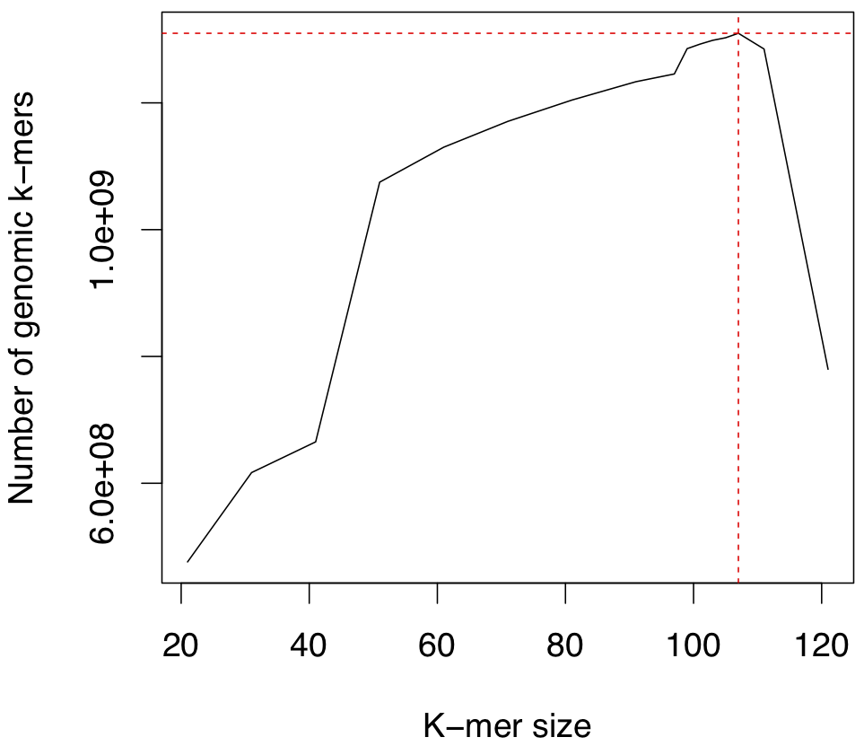

# Emo
Genome sequencing and annotation of *Ecdeiocolea monostachya*

The Australian wild grass *Ecdeiocolea monostachya* is a critical outgroup to the Poaceae for comparative genomics analyses. We initiated the genome sequencing of *E. monostachya* in 2018 to identify signatures of genetic innovations in the grasses. More broadly, the sequencing of *E. monostachya* will provide a robust foundation for researchers in cereal genomics to utilise this understudied species as an outgroup in studies of evolutionary events unique to the Poaceae, not limited to our work on the emergence of novel gene families. *E. monostachya* is recalcitrant to growth from seed or after transplant to botanical gardens. Therefore, we have collected tissue from several individuals from a single site in Australia. *E. monostachya* is expected to be diploid with a genome size of 1.5 Gb based on flow cytometry. We propose to construct large scaffolds of the *E. monostachya genome* using Oxford Nanopore Technologies and Illumina-based sequencing. Parallel work is currently underway to perform RNAseq on sheath, flower, and root tissue. This project will be carried out as an Open Science initiative, ensuring that the academic community will gain immediate access to the genome and annotations as they are developed.

## Illumina-based sequencing and assembly of *Ecdeiocolea monostachya*
Sheath tissue from accession E001 was collected, genomic DNA extracted, and DNA sent to Novogene for sequencing. Illumina paired end libraries were generated using inserts of 250bp (DSW66921) and 350bp (DSW66909-V) (150 bp reads). *De novo* assemblies were carried out using several Amazon AWS EC2 instances including (1) m5a.12xlarge (48 CPU, 192 GB RAM), (2) r5.12xlarge (48 CPU, 374 Gb RAM), and (3) m5.24xlarge (96 CPU, 345 Gb RAM).

### Trimmomatic cleaning of Illumina PE reads
Trimmomatic v0.36 was used to clean reads prior to *de novo* assembly. A size limit of 36 bp is set for the retention of paired reads.

```bash
java -jar trimmomatic-0.36.jar PE -threads 16 -phred33 EM009_E1_DSW66909-V_HTGL5CCXY_L6_1.fq.gz EM009_E1_DSW66909-V_HTGL5CCXY_L6_2.fq.gz Ecdeiocolea_monostachya_350_1_gDNA_forward_paired.fq.gz Ecdeiocolea_monostachya_350_1_gDNA_forward_unpaired.fq.gz Ecdeiocolea_monostachya_350_1_gDNA_reverse_paired.fq.gz Ecdeiocolea_monostachya_350_1_gDNA_reverse_unpaired.fq.gz ILLUMINACLIP:TruSeq3-PE.fa:2:30:10 LEADING:5 TRAILING:5 SLIDINGWINDOW:4:10 MINLEN:36 > Ecdeiocolea_monostachya_350_1_trimmomatic.run.log 2>&1 &
java -jar trimmomatic-0.36.jar PE -threads 16 -phred33 EM009_E1_DSW66909-V_HTH7NCCXY_L7_1.fq.gz EM009_E1_DSW66909-V_HTH7NCCXY_L7_2.fq.gz Ecdeiocolea_monostachya_350_2_gDNA_forward_paired.fq.gz Ecdeiocolea_monostachya_350_2_gDNA_forward_unpaired.fq.gz Ecdeiocolea_monostachya_350_2_gDNA_reverse_paired.fq.gz Ecdeiocolea_monostachya_350_2_gDNA_reverse_unpaired.fq.gz ILLUMINACLIP:TruSeq3-PE.fa:2:30:10 LEADING:5 TRAILING:5 SLIDINGWINDOW:4:10 MINLEN:36 > Ecdeiocolea_monostachya_350_2_trimmomatic.run.log 2>&1 &
java -jar trimmomatic-0.36.jar PE -threads 16 -phred33 EM009_E1_DSW66909-V_HTGL5CCXY_L7_1.fq.gz EM009_E1_DSW66909-V_HTGL5CCXY_L7_2.fq.gz Ecdeiocolea_monostachya_350_3_gDNA_forward_paired.fq.gz Ecdeiocolea_monostachya_350_3_gDNA_forward_unpaired.fq.gz Ecdeiocolea_monostachya_350_3_gDNA_reverse_paired.fq.gz Ecdeiocolea_monostachya_350_3_gDNA_reverse_unpaired.fq.gz ILLUMINACLIP:TruSeq3-PE.fa:2:30:10 LEADING:5 TRAILING:5 SLIDINGWINDOW:4:10 MINLEN:36 > Ecdeiocolea_monostachya_350_3_trimmomatic.run.log 2>&1 &
java -jar trimmomatic-0.36.jar PE -threads 16 -phred33 EM009_E1_DSW66909-V_HWHMWCCXY_L8_1.fq.gz EM009_E1_DSW66909-V_HWHMWCCXY_L8_2.fq.gz Ecdeiocolea_monostachya_350_4_gDNA_forward_paired.fq.gz Ecdeiocolea_monostachya_350_4_gDNA_forward_unpaired.fq.gz Ecdeiocolea_monostachya_350_4_gDNA_reverse_paired.fq.gz Ecdeiocolea_monostachya_350_4_gDNA_reverse_unpaired.fq.gz ILLUMINACLIP:TruSeq3-PE.fa:2:30:10 LEADING:5 TRAILING:5 SLIDINGWINDOW:4:10 MINLEN:36 > Ecdeiocolea_monostachya_350_4_trimmomatic.run.log 2>&1 &
java -jar trimmomatic-0.36.jar PE -threads 16 -phred33 EM009_E1_DSW66921_HTGL5CCXY_L6_1.fq.gz EM009_E1_DSW66921_HTGL5CCXY_L6_2.fq.gz Ecdeiocolea_monostachya_250_1_gDNA_forward_paired.fq.gz Ecdeiocolea_monostachya_250_1_gDNA_forward_unpaired.fq.gz Ecdeiocolea_monostachya_250_1_gDNA_reverse_paired.fq.gz Ecdeiocolea_monostachya_250_1_gDNA_reverse_unpaired.fq.gz ILLUMINACLIP:TruSeq3-PE.fa:2:30:10 LEADING:5 TRAILING:5 SLIDINGWINDOW:4:10 MINLEN:36 > Ecdeiocolea_monostachya_250_1_trimmomatic.run.log 2>&1 &
java -jar trimmomatic-0.36.jar PE -threads 16 -phred33 EM009_E1_DSW66921_HTGL5CCXY_L7_1.fq.gz EM009_E1_DSW66921_HTGL5CCXY_L7_2.fq.gz Ecdeiocolea_monostachya_250_2_gDNA_forward_paired.fq.gz Ecdeiocolea_monostachya_250_2_gDNA_forward_unpaired.fq.gz Ecdeiocolea_monostachya_250_2_gDNA_reverse_paired.fq.gz Ecdeiocolea_monostachya_250_2_gDNA_reverse_unpaired.fq.gz ILLUMINACLIP:TruSeq3-PE.fa:2:30:10 LEADING:5 TRAILING:5 SLIDINGWINDOW:4:10 MINLEN:36 > Ecdeiocolea_monostachya_250_2_trimmomatic.run.log 2>&1 &
```

Reads were also cleaned based on the stringent requirement that all 150 bp meet quality requirements prior to *de novo* assembly (needed for `edena`).

```bash
java -jar trimmomatic-0.36.jar PE -threads 16 -phred33 EM009_E1_DSW66909-V_HTGL5CCXY_L6_1.fq.gz EM009_E1_DSW66909-V_HTGL5CCXY_L6_2.fq.gz Ecdeiocolea_monostachya_350_1_gDNA_edena_forward_paired.fq.gz Ecdeiocolea_monostachya_350_1_gDNA_edena_forward_unpaired.fq.gz Ecdeiocolea_monostachya_350_1_gDNA_edena_reverse_paired.fq.gz Ecdeiocolea_monostachya_350_1_gDNA_edena_reverse_unpaired.fq.gz ILLUMINACLIP:TruSeq3-PE.fa:2:30:10 LEADING:5 TRAILING:5 SLIDINGWINDOW:4:10 MINLEN:150 > Ecdeiocolea_monostachya_350_1_edena_trimmomatic.run.log 2>&1 &
java -jar trimmomatic-0.36.jar PE -threads 16 -phred33 EM009_E1_DSW66909-V_HTH7NCCXY_L7_1.fq.gz EM009_E1_DSW66909-V_HTH7NCCXY_L7_2.fq.gz Ecdeiocolea_monostachya_350_2_gDNA_edena_forward_paired.fq.gz Ecdeiocolea_monostachya_350_2_gDNA_edena_forward_unpaired.fq.gz Ecdeiocolea_monostachya_350_2_gDNA_edena_reverse_paired.fq.gz Ecdeiocolea_monostachya_350_2_gDNA_edena_reverse_unpaired.fq.gz ILLUMINACLIP:TruSeq3-PE.fa:2:30:10 LEADING:5 TRAILING:5 SLIDINGWINDOW:4:10 MINLEN:150 > Ecdeiocolea_monostachya_350_2_edena_trimmomatic.run.log 2>&1 &
java -jar trimmomatic-0.36.jar PE -threads 16 -phred33 EM009_E1_DSW66909-V_HTGL5CCXY_L7_1.fq.gz EM009_E1_DSW66909-V_HTGL5CCXY_L7_2.fq.gz Ecdeiocolea_monostachya_350_3_gDNA_edena_forward_paired.fq.gz Ecdeiocolea_monostachya_350_3_gDNA_edena_forward_unpaired.fq.gz Ecdeiocolea_monostachya_350_3_gDNA_edena_reverse_paired.fq.gz Ecdeiocolea_monostachya_350_3_gDNA_edena_reverse_unpaired.fq.gz ILLUMINACLIP:TruSeq3-PE.fa:2:30:10 LEADING:5 TRAILING:5 SLIDINGWINDOW:4:10 MINLEN:150 > Ecdeiocolea_monostachya_350_3_edena_trimmomatic.run.log 2>&1 &
java -jar trimmomatic-0.36.jar PE -threads 16 -phred33 EM009_E1_DSW66909-V_HWHMWCCXY_L8_1.fq.gz EM009_E1_DSW66909-V_HWHMWCCXY_L8_2.fq.gz Ecdeiocolea_monostachya_350_4_gDNA_edena_forward_paired.fq.gz Ecdeiocolea_monostachya_350_4_gDNA_edena_forward_unpaired.fq.gz Ecdeiocolea_monostachya_350_4_gDNA_edena_reverse_paired.fq.gz Ecdeiocolea_monostachya_350_4_gDNA_edena_reverse_unpaired.fq.gz ILLUMINACLIP:TruSeq3-PE.fa:2:30:10 LEADING:5 TRAILING:5 SLIDINGWINDOW:4:10 MINLEN:150 > Ecdeiocolea_monostachya_350_4_edena_trimmomatic.run.log 2>&1 &
java -jar trimmomatic-0.36.jar PE -threads 16 -phred33 EM009_E1_DSW66921_HTGL5CCXY_L6_1.fq.gz EM009_E1_DSW66921_HTGL5CCXY_L6_2.fq.gz Ecdeiocolea_monostachya_250_1_gDNA_edena_forward_paired.fq.gz Ecdeiocolea_monostachya_250_1_gDNA_edena_forward_unpaired.fq.gz Ecdeiocolea_monostachya_250_1_gDNA_edena_reverse_paired.fq.gz Ecdeiocolea_monostachya_250_1_gDNA_edena_reverse_unpaired.fq.gz ILLUMINACLIP:TruSeq3-PE.fa:2:30:10 LEADING:5 TRAILING:5 SLIDINGWINDOW:4:10 MINLEN:150 > Ecdeiocolea_monostachya_250_1_edena_trimmomatic.run.log 2>&1 &
java -jar trimmomatic-0.36.jar PE -threads 16 -phred33 EM009_E1_DSW66921_HTGL5CCXY_L7_1.fq.gz EM009_E1_DSW66921_HTGL5CCXY_L7_2.fq.gz Ecdeiocolea_monostachya_250_2_gDNA_edena_forward_paired.fq.gz Ecdeiocolea_monostachya_250_2_gDNA_edena_forward_unpaired.fq.gz Ecdeiocolea_monostachya_250_2_gDNA_edena_reverse_paired.fq.gz Ecdeiocolea_monostachya_250_2_gDNA_edena_reverse_unpaired.fq.gz ILLUMINACLIP:TruSeq3-PE.fa:2:30:10 LEADING:5 TRAILING:5 SLIDINGWINDOW:4:10 MINLEN:150 > Ecdeiocolea_monostachya_250_2_edena_trimmomatic.run.log 2>&1 &
```

### Assessment of *k*-mer distribution
`jellyfish` 1.1.12 was used to assess *k*-mer distribution, determine the presence of heterozygosity, and estimate genome size. Four *k*-mer were selected (17, 24, 27, and 31).

```bash
jellyfish count -t 12 -C -m 17 -s 30G -o emo_jellyfish_17mer Ecdeiocolea_monostachya_250_1_gDNA_forward_paired.fq Ecdeiocolea_monostachya_250_1_gDNA_reverse_paired.fq Ecdeiocolea_monostachya_250_2_gDNA_forward_paired.fq Ecdeiocolea_monostachya_250_2_gDNA_reverse_paired.fq Ecdeiocolea_monostachya_350_1_gDNA_forward_paired.fq Ecdeiocolea_monostachya_350_1_gDNA_reverse_paired.fq Ecdeiocolea_monostachya_350_2_gDNA_forward_paired.fq Ecdeiocolea_monostachya_350_2_gDNA_reverse_paired.fq Ecdeiocolea_monostachya_350_3_gDNA_forward_paired.fq Ecdeiocolea_monostachya_350_3_gDNA_reverse_paired.fq Ecdeiocolea_monostachya_350_4_gDNA_forward_paired.fq Ecdeiocolea_monostachya_350_4_gDNA_reverse_paired.fq
jellyfish histo -h 3000000 -o emo_jellyfish_17mer.histo emo_jellyfish_17mer_0

jellyfish count -t 48 -C -m 24 -s 30G -o emo_jellyfish_24mer Ecdeiocolea_monostachya_250_1_gDNA_forward_paired.fq Ecdeiocolea_monostachya_250_1_gDNA_reverse_paired.fq Ecdeiocolea_monostachya_250_2_gDNA_forward_paired.fq Ecdeiocolea_monostachya_250_2_gDNA_reverse_paired.fq Ecdeiocolea_monostachya_350_1_gDNA_forward_paired.fq Ecdeiocolea_monostachya_350_1_gDNA_reverse_paired.fq Ecdeiocolea_monostachya_350_2_gDNA_forward_paired.fq Ecdeiocolea_monostachya_350_2_gDNA_reverse_paired.fq Ecdeiocolea_monostachya_350_3_gDNA_forward_paired.fq Ecdeiocolea_monostachya_350_3_gDNA_reverse_paired.fq Ecdeiocolea_monostachya_350_4_gDNA_forward_paired.fq Ecdeiocolea_monostachya_350_4_gDNA_reverse_paired.fq
jellyfish histo -h 3000000 -o emo_jellyfish_24mer.histo emo_jellyfish_24mer_0

jellyfish count -t 12 -C -m 27 -s 30G -o emo_jellyfish_27mer Ecdeiocolea_monostachya_250_1_gDNA_forward_paired.fq Ecdeiocolea_monostachya_250_1_gDNA_reverse_paired.fq Ecdeiocolea_monostachya_250_2_gDNA_forward_paired.fq Ecdeiocolea_monostachya_250_2_gDNA_reverse_paired.fq Ecdeiocolea_monostachya_350_1_gDNA_forward_paired.fq Ecdeiocolea_monostachya_350_1_gDNA_reverse_paired.fq Ecdeiocolea_monostachya_350_2_gDNA_forward_paired.fq Ecdeiocolea_monostachya_350_2_gDNA_reverse_paired.fq Ecdeiocolea_monostachya_350_3_gDNA_forward_paired.fq Ecdeiocolea_monostachya_350_3_gDNA_reverse_paired.fq Ecdeiocolea_monostachya_350_4_gDNA_forward_paired.fq Ecdeiocolea_monostachya_350_4_gDNA_reverse_paired.fq
jellyfish histo -h 3000000 -o emo_jellyfish_27mer.histo emo_jellyfish_27mer_0

jellyfish count -t 12 -C -m 31 -s 30G -o emo_jellyfish_31mer Ecdeiocolea_monostachya_250_1_gDNA_forward_paired.fq Ecdeiocolea_monostachya_250_1_gDNA_reverse_paired.fq Ecdeiocolea_monostachya_250_2_gDNA_forward_paired.fq Ecdeiocolea_monostachya_250_2_gDNA_reverse_paired.fq Ecdeiocolea_monostachya_350_1_gDNA_forward_paired.fq Ecdeiocolea_monostachya_350_1_gDNA_reverse_paired.fq Ecdeiocolea_monostachya_350_2_gDNA_forward_paired.fq Ecdeiocolea_monostachya_350_2_gDNA_reverse_paired.fq Ecdeiocolea_monostachya_350_3_gDNA_forward_paired.fq Ecdeiocolea_monostachya_350_3_gDNA_reverse_paired.fq Ecdeiocolea_monostachya_350_4_gDNA_forward_paired.fq Ecdeiocolea_monostachya_350_4_gDNA_reverse_paired.fq > jellyfish.31mer.log 2>&1 &
jellyfish histo -h 3000000 -o emo_jellyfish_31mer.histo emo_jellyfish_31mer_0
```

`R` and `ggplot2` were used to visualize the results, *k*=24 is shown below.

```R
library(ggplot2)

data = read.table(file="emo_jellyfish_24mer.histo.ID", header=T)
data = data.frame(data)

postscript(file="emo_jellyfish_24mer_distribution.ps", width=6, height=4)
ggplot(data, aes(k, count)) + geom_point() + xlim(c(4,400)) + ylim(c(0,1.5e7)) + xlab("Frequency") + ylab("Total counts")
dev.off()
```


Sequencing of *Ecdeiocolea monostachya* accession E01 exhibits two local maxima, which indicates that this accession is heterozygous and diploid. We used the function `localMaxima` in order to identify the peaks in the distribution.

```
localMaxima <- function(x) {
  # Use -Inf instead if x is numeric (non-integer)
  y <- diff(c(-.Machine$integer.max, x)) > 0L
  rle(y)$lengths
  y <- cumsum(rle(y)$lengths)
  y <- y[seq.int(1L, length(y), 2L)]
  if (x[[1]] == x[[2]]) {
    y <- y[-1]
  }
  y
}

localMaxima(data$count[5:400])
```

The results below indicate the peaks are at 77 and 161.

```R
 [1]   1  77 161 247 299 326 329 331 334 389 395
```

#### findGSE
Next, we use [findGSE](https://github.com/schneebergerlab/findGSE) from the Schneeberger laboratory to get an estimate of genome size.

```R
library("findGSE")
findGSE(histo="emo_jellyfish_24mer.histo", sizek=24, outdir="emo_jellyfish_24mer_findGSE")
```

```R
Genome size estimate for emo_jellyfish_24mer.histo: 1477061969 bp.
```

The final estimate was 1.47 Gb. This is a slightly lower genome size estimate as compared to flow cytometry of propidium iodide-stained nuclei, of which this accession was found to have 2C = ~2.0 pg = ~2.0 Gb). This needs to be run again in order to take into account the heterozygosity of the genome.

#### KmerGenie
`KmerGenie` 1.7048 was used to characterize the *k*-mer distribution based on several *k* and to identify an optimal *k* for genome assembly. The file `list_files` was simply the FASTQ files for all Illumina sequencing data. Code was downloaded from [KmerGenie](http://kmergenie.bx.psu.edu/).

```bash
~/genome/src/kmergenie-1.7051/kmergenie list_files --diploid -t 46
```



The best predicted *k* = 107 with a predicted genome size of 1.31 Gb. Results can be found in `data/kmerGenie`.

#### GenomeScope
We used [GenomeScope](http://qb.cshl.edu/genomescope/) to estimate genome size.

```
k = 17
property                      min               max               
Heterozygosity                2.64181%          2.64873%          
Genome Haploid Length         734,023,481 bp    734,209,998 bp    
Genome Repeat Length          430,584,456 bp    430,693,869 bp    
Genome Unique Length          303,439,025 bp    303,516,129 bp    
Model Fit                     89.126%           95.3707%          
Read Error Rate               0.198027%         0.198027%

k = 24
property                      min               max               
Heterozygosity                2.59395%          2.59696%          
Genome Haploid Length         839,124,480 bp    839,220,218 bp    
Genome Repeat Length          359,761,145 bp    359,802,191 bp    
Genome Unique Length          479,363,335 bp    479,418,027 bp    
Model Fit                     93.8441%          96.7131%          
Read Error Rate               0.204901%         0.204901%

k = 27
property                      min               max               
Heterozygosity                2.47079%          2.47592%          
Genome Haploid Length         774,237,454 bp    774,395,503 bp    
Genome Repeat Length          265,031,305 bp    265,085,407 bp    
Genome Unique Length          509,206,149 bp    509,310,096 bp    
Model Fit                     94.3308%          96.7982%          
Read Error Rate               0.211569%         0.211569%

k = 31
property                      min               max               
Heterozygosity                2.32526%          2.33019%          
Genome Haploid Length         782,469,719 bp    782,632,214 bp    
Genome Repeat Length          241,596,167 bp    241,646,339 bp    
Genome Unique Length          540,873,552 bp    540,985,875 bp    
Model Fit                     94.7857%          96.8541%          
Read Error Rate               0.202396%         0.202396%
```

Genome size estimates were considerably smaller than other software.

### *De novo* assembly using edena
`edena` 3.131028 was used for *de novo* genome assembly.

```bash
edena -paired Ecdeiocolea_monostachya_250_1_gDNA_edena_forward_paired.fq Ecdeiocolea_monostachya_250_1_gDNA_edena_reverse_paired.fq Ecdeiocolea_monostachya_250_2_gDNA_edena_forward_paired.fq Ecdeiocolea_monostachya_250_2_gDNA_edena_reverse_paired.fq Ecdeiocolea_monostachya_350_1_gDNA_edena_forward_paired.fq Ecdeiocolea_monostachya_350_1_gDNA_edena_reverse_paired.fq Ecdeiocolea_monostachya_350_2_gDNA_edena_forward_paired.fq Ecdeiocolea_monostachya_350_2_gDNA_edena_reverse_paired.fq Ecdeiocolea_monostachya_350_3_gDNA_edena_forward_paired.fq Ecdeiocolea_monostachya_350_3_gDNA_edena_reverse_paired.fq Ecdeiocolea_monostachya_350_4_gDNA_edena_forward_paired.fq Ecdeiocolea_monostachya_350_4_gDNA_edena_reverse_paired.fq -p Emo_edena_v1 -nThreads 96 > Emo.edena.run.log 2>&1 &
edena -e Emo_edena_v1.ovl -m 80 -p Emo_edena_v1_m80 > Emo.edena.ovl_m80.run.log 2>&1 &
edena -e Emo_edena_v1.ovl -m 100 -p Emo_edena_v1_m100 > Emo.edena.ovl_m100.run.log 2>&1 &
edena -e Emo_edena_v1.ovl -m 120 -p Emo_edena_v1_m120 > Emo.edena.ovl_m120.run.log 2>&1 &
```

This initial run failed (*k*=96), likely due to the need of more memory. Consider running it again at a later date. Also, ensure all files are decompressed.

### *De novo* assembly using ABySS
`ABySS` version 1.3.6 was used for *de novo* genome assembly. Source code was cloned from Github from [ABySS](https://github.com/bcgsc/abyss).

```bash
abyss-pe k=96 name=Emo_abyss_k96 lib='pea peb pec ped pee pef' pea='Ecdeiocolea_monostachya_250_1_gDNA_forward_paired.fq Ecdeiocolea_monostachya_250_1_gDNA_reverse_paired.fq' peb='Ecdeiocolea_monostachya_250_2_gDNA_forward_paired.fq Ecdeiocolea_monostachya_250_2_gDNA_reverse_paired.fq' pec='Ecdeiocolea_monostachya_350_1_gDNA_forward_paired.fq Ecdeiocolea_monostachya_350_1_gDNA_reverse_paired.fq' ped='Ecdeiocolea_monostachya_350_2_gDNA_forward_paired.fq Ecdeiocolea_monostachya_350_2_gDNA_reverse_paired.fq' pee='Ecdeiocolea_monostachya_350_3_gDNA_forward_paired.fq Ecdeiocolea_monostachya_350_3_gDNA_reverse_paired.fq' pef='Ecdeiocolea_monostachya_350_4_gDNA_forward_paired.fq Ecdeiocolea_monostachya_350_4_gDNA_reverse_paired.fq' np=48 > Emo.abyss.k96.run.log 2>&1 &
```

This initial run failed (*k*=96), likely due to the need of more memory. Consider running it again at a later date. Also, ensure all files are decompressed.


### *De novo* assembly using IDBA-UD
IDBA is the basic iterative de Bruijn graph assembler for second-generation sequencing reads. IDBA-UD, an extension of IDBA, is designed to utilize paired-end reads to assemble low-depth regions and use progressive depth on contigs to reduce errors in high-depth regions is a fuzzy Bruijn graph approach to long noisy reads assembly. Source code was cloned from Github from [IDBA](https://github.com/loneknightpy/idba).

```bash
~/genome/src/idba/bin/fq2fa --filter --merge Ecdeiocolea_monostachya_250_1_gDNA_forward_paired.fq Ecdeiocolea_monostachya_250_1_gDNA_reverse_paired.fq Ecdeiocolea_monostachya_250_1_gDNA_paired.fa
~/genome/src/idba/bin/fq2fa --filter --merge Ecdeiocolea_monostachya_250_2_gDNA_forward_paired.fq Ecdeiocolea_monostachya_250_2_gDNA_reverse_paired.fq Ecdeiocolea_monostachya_250_2_gDNA_paired.fa
~/genome/src/idba/bin/fq2fa --filter --merge Ecdeiocolea_monostachya_350_1_gDNA_forward_paired.fq Ecdeiocolea_monostachya_350_1_gDNA_reverse_paired.fq Ecdeiocolea_monostachya_350_1_gDNA_paired.fa
~/genome/src/idba/bin/fq2fa --filter --merge Ecdeiocolea_monostachya_350_2_gDNA_forward_paired.fq Ecdeiocolea_monostachya_350_2_gDNA_reverse_paired.fq Ecdeiocolea_monostachya_350_2_gDNA_paired.fa
~/genome/src/idba/bin/fq2fa --filter --merge Ecdeiocolea_monostachya_350_3_gDNA_forward_paired.fq Ecdeiocolea_monostachya_350_3_gDNA_reverse_paired.fq Ecdeiocolea_monostachya_350_3_gDNA_paired.fa
~/genome/src/idba/bin/fq2fa --filter --merge Ecdeiocolea_monostachya_350_4_gDNA_forward_paired.fq Ecdeiocolea_monostachya_350_4_gDNA_reverse_paired.fq Ecdeiocolea_monostachya_350_4_gDNA_paired.fa

cat Ecdeiocolea_monostachya_250_1_gDNA_paired.fa Ecdeiocolea_monostachya_250_2_gDNA_paired.fa Ecdeiocolea_monostachya_350_1_gDNA_paired.fa Ecdeiocolea_monostachya_350_2_gDNA_paired.fa Ecdeiocolea_monostachya_350_3_gDNA_paired.fa Ecdeiocolea_monostachya_350_4_gDNA_paired.fa > Ecdeiocolea_monostachya_gDNA_paired.fa
~/genome/src/idba/bin/idba_ud -r Ecdeiocolea_monostachya_gDNA_paired.fa -o Emo_idba --num_threads 46
```

### *De novo* assembly using SOAPdenovo2
`SOAPdenovo2` is a de novo de Bruijn graph assembler. Source code was cloned from Github from [SOAPdenovo2](https://github.com/aquaskyline/SOAPdenovo2).

```bash
soapdenovo2-63mer pregraph -s Emo.config -K 63 -R -p 40 -o Emo_soapdenovo2_k63 1>pregraph.log 2>pregraph.err
soapdenovo2-63mer contig -g Emo_soapdenovo2_k63 -R -p 46 1>contig.log 2>contig.err &
soapdenovo2-63mer map -s Emo.config -g Emo_soapdenovo2_k63 -p 46 1>map.log 2>map.err &
soapdenovo2-63mer scaff -g Emo_soapdenovo2_k63 -F -p 46 1>scaff.log 2>scaff.err &

soapdenovo2-127mer pregraph -s Emo.config -K 107 -R -p 40 -o Emo_soapdenovo2_k107 1>pregraph.log 2>pregraph.err
soapdenovo2-127mer contig -g Emo_soapdenovo2_k107 -R -p 46 1>contig.log 2>contig.err &
soapdenovo2-127mer map -s Emo.config -g Emo_soapdenovo2_k107 -p 46 1>map.log 2>map.err &
soapdenovo2-127mer scaff -g Emo_soapdenovo2_k107 -F -p 46 1>scaff.log 2>scaff.err &
```

### *De novo* assembly using minia
`minia` is a short-read assembler based on a de Bruijn graph with low memory requirements. 

```bash
~/genome/bin/minia -in Ecdeiocolea_monostachya_gDNA_paired.fa -kmer-size 21 -out Emo.minia.k21 > Emo.minia.k21.log 2>&1 &
~/genome/bin/minia -in Ecdeiocolea_monostachya_gDNA_paired.fa -kmer-size 31 -out Emo.minia.k31 > Emo.minia.k31.log 2>&1 &
~/genome/bin/minia -in Ecdeiocolea_monostachya_gDNA_paired.fa -kmer-size 41 -out Emo.minia.k41 > Emo.minia.k41.log 2>&1 &
~/genome/bin/minia -in Ecdeiocolea_monostachya_gDNA_paired.fa -kmer-size 51 -out Emo.minia.k51 > Emo.minia.k51.log 2>&1 &
~/genome/bin/minia -in Ecdeiocolea_monostachya_gDNA_paired.fa -kmer-size 61 -out Emo.minia.k61 > Emo.minia.k61.log 2>&1 &
~/genome/bin/minia -in Ecdeiocolea_monostachya_gDNA_paired.fa -kmer-size 71 -out Emo.minia.k71 > Emo.minia.k71.log 2>&1 &
~/genome/bin/minia -in Ecdeiocolea_monostachya_gDNA_paired.fa -kmer-size 81 -out Emo.minia.k81 > Emo.minia.k81.log 2>&1 &
~/genome/bin/minia -in Ecdeiocolea_monostachya_gDNA_paired.fa -kmer-size 91 -out Emo.minia.k91 > Emo.minia.k91.log 2>&1 &
~/genome/bin/minia -in Ecdeiocolea_monostachya_gDNA_paired.fa -kmer-size 97 -out Emo.minia.k97 > Emo.minia.k97.log 2>&1 &
~/genome/bin/minia -in Ecdeiocolea_monostachya_gDNA_paired.fa -kmer-size 99 -out Emo.minia.k99 > Emo.minia.k99.log 2>&1 &
~/genome/bin/minia -in Ecdeiocolea_monostachya_gDNA_paired.fa -kmer-size 101 -out Emo.minia.k101 > Emo.minia.k101.log 2>&1 &
~/genome/bin/minia -in Ecdeiocolea_monostachya_gDNA_paired.fa -kmer-size 103 -out Emo.minia.k103 > Emo.minia.k103.log 2>&1 &
~/genome/bin/minia -in Ecdeiocolea_monostachya_gDNA_paired.fa -kmer-size 105 -out Emo.minia.k105 > Emo.minia.k105.log 2>&1 &
~/genome/bin/minia -in Ecdeiocolea_monostachya_gDNA_paired.fa -kmer-size 107 -out Emo.minia.k107 > Emo.minia.k107.log 2>&1 &
~/genome/bin/minia -in Ecdeiocolea_monostachya_gDNA_paired.fa -kmer-size 111 -out Emo.minia.k111 > Emo.minia.k111.log 2>&1 &
~/genome/bin/minia -in Ecdeiocolea_monostachya_gDNA_paired.fa -kmer-size 121 -out Emo.minia.k121 > Emo.minia.k121.log 2>&1 &
```

### Assessment of *de novo* genome assemblies using Illumina
An initial assessment of *de novo* genome assemblies using Illumina sequencing data was performed using `assembly-stats`. Source code was cloned from Github from [assembly-stats](https://github.com/sanger-pathogens/assembly-stats).

```bash
assembly-stats -t Emo.minia.k*.contigs.fa > Emo.minia.stats.txt
```

```bash
export AUGUSTUS_CONFIG_PATH=/usr/share/augustus/config/
```

Our principal strategy for assessing the quality of a genome assembly was to determine the assembly that had both the highest rate of RNAseq mapping and number of complete BUSCO genes based on a uniform `hisat2` and `Cufflinks` gene model prediction. A template protocol for aligning RNAseq data to the `minia` assemblies is shown below.

```bash
~/emo/src/hisat2-2.1.0/hisat2-build -p 46 Emo.minia.k$1.contigs.fa Emo.minia.k$1.contigs
~/emo/src/hisat2-2.1.0/hisat2 --max-intronlen 20000 -k 1 -p 46 --no-softclip --dta-cufflinks -x Emo.minia.k$1.contigs -1 Ecdeiocolea_monostachya_$2_RNAseq_forward_paired.fq.gz -2 Ecdeiocolea_monostachya_$2_RNAseq_forward_paired.fq.gz -S Emo.minia.k$1.contigs_E01flower_RNAseq.cufflinks.sam
samtools view -F 4 -Shub Emo.minia.k$1.contigs_$2_RNAseq.cufflinks.sam > Emo.minia.k$1.contigs_$2_RNAseq.cufflinks.bam
samtools sort -o Emo.minia.k$1.contigs_$2_RNAseq.cufflinks.sorted.bam Emo.minia.k$1.contigs_$2_RNAseq.cufflinks.bam
cufflinks/cufflinks -p 4 Emo.minia.k$1.contigs_$2_RNAseq.cufflinks.sorted.bam
```

`Cuffmerge` is used to merge all `Cufflink` gene models, `gffread` to extract the transcripts, and `BUSCO` to determine the number of complete gene models.

```
cuffmerge -o cuffmerge_Emo_edena_v1_m100_contigs -p 120 cuffmerge_Emo_edena_v1_m100_contigs.txt
cuffmerge -o cuffmerge_Emo_idba_scaffold -p 12 cuffmerge_Emo_idba_scaffold.txt
cuffmerge -o cuffmerge_Emo_minia_k121 -p 12 cuffmerge_Emo_minia_k121.txt
cuffmerge -o cuffmerge_Emo_soapdenovo2_k63 -p 12 cuffmerge_Emo_soapdenovo2_k63.txt

gffread cuffmerge_Emo_edena_v1_m100_contigs/merged.gtf -g Emo_edena_v1_m100_contigs.fasta -w Emo_edena_v1_m100_contigs_transcripts.fa
gffread cuffmerge_Emo_idba_scaffold/merged.gtf -g Emo.idba.scaffold.fa -w Emo.idba.scaffold_transcripts.fa
gffread cuffmerge_Emo_minia_k121/merged.gtf -g Emo.minia.k121.contigs.fa -w Emo.minia.k121.contigs_transcripts.fa
gffread cuffmerge_Emo_soapdenovo2_k63/merged.gtf -g Emo_soapdenovo2_k63.scafSeq -w Emo_soapdenovo2_k63.scafSeq_transcripts.fa

./scripts/run_BUSCO.py -i Emo_edena_v1_m100_contigs_transcripts.fa -o Emo_edena_v1_m100_contigs_transcripts.busco --lineage_path embryophyta_odb9 -m transcriptome -c 48 > Emo_edena_v1_m100_contigs_transcripts.busco.log 2>&1 &
./scripts/run_BUSCO.py -i Emo.idba.scaffold_transcripts.fa -o Emo.idba.scaffold_transcripts.busco --lineage_path embryophyta_odb9 -m transcriptome -c 12 > Emo.idba.scaffold_transcripts.busco.log 2>&1 &
./scripts/run_BUSCO.py -i Emo.minia.k121.contigs_transcripts.fa -o Emo.minia.k121.contigs_transcripts.busco --lineage_path embryophyta_odb9 -m transcriptome -c 16 > Emo.minia.k121.contigs_transcripts.busco.log 2>&1 &
./scripts/run_BUSCO.py -i Emo_soapdenovo2_k63.scafSeq_transcripts.fa -o Emo_soapdenovo2_k63.scafSeq_transcripts.busco --lineage_path embryophyta_odb9 -m transcriptome -c 12 > Emo_soapdenovo2_k63.scafSeq_transcripts.busco.log 2>&1 &


cuffmerge -s reconciled_assembly_v4.fa -p 4 gtf_files.txt
gffread merged_asm/merged.gtf -g reconciled_assembly_v4.fa -w transcripts_CGS.fa
TransDecoder.LongOrfs -t transcripts_CGS.fa
./interproscan.sh --output-dir . --input longest_orfs.pep --iprlookup --seqtype p --appl Coils,Gene3D,ProSitePatterns,Pfam,PANTHER,SUPERFAMILY > longest_orfs_interproscan.log 2>&1 &
```

The number of aligned RNAseq reads for each tissue and assembly are shown below.

| Assembly            | Flower |  Root  | Sheath |
|:-------------------:|:------:|:------:|:------:|
| IDBA-UD             | 75.28% | 74.50% | 73.82% |
| SOAPdenovo2 (*k*=63)| 64.53% | 63.47% | 62.81% |
| minia (*k*=121)     | 73.28% | 72.62% | 72.58% |

The BUSCO dataset is based on 1,440 (generally) single copy orthologs. At this stage, IDBA-UD from Illumina data has done best, but clearly a number of gene models are missing. This is due to the small insert size for Illumina data and requires long read data.

| Assembly           | Data            | Complete | Singleton | Duplicated | Fragment | Missing |
|:------------------:|:---------------:|:--------:|:---------:|:----------:|:--------:|:-------:|
|IDBA-UD             | gDNA (Illumina) | 42.5%    | 28.3%     | 14.2%      | 29.0%    | 28.5%   |
|minia (*k*=121)     | gDNA (Illumina) | 27.7%    | 16.9%     | 10.8%      | 31.7%    | 40.6%   |
|SOAPDenovo2 (*k*=63)| gDNA (Illumina) | 34.1%    | 19.4%     | 14.7%      | 27.8%    | 38.1%   |
|Trinity (Sheath)    | mRNA (Illumina) | 86.6%    | 23.4%     | 63.2%      | 9.5%     | 3.9%    |
|Trinity (Root)      | mRNA (Illumina) | 85.9%    | 26.5%     | 59.4%      | 9.1%     | 5.0%    |
|Trinity (Flower)    | mRNA (Illumina) | 88.4%    | 25.7%     | 62.7%      | 7.4%     | 4.2%    |


## Nanopore sequencing and assembly of *Ecdeiocolea monostachya*
### Sequence length distribution
The distribution of read length from Oxford Nanopore Technologies sequencing is shown in the table below. The longest read was 849 kb and median read length 4.6 kb.

| Quantile | Sequence length (bp) |
|:--------:|:--------------------:|
|     0%   |             500      |
|    25%   |           1,771      |
|    50%   |           4,652      |
|    75%   |          12,642      |
|   100%   |         849,007      |

The total length of sequence is 69.7 Gb, which represents 83x coverage with an estimated haploid genome size of 839 Mb. 

Histograms of the read length distribution were generated using `R`.

```R
library(ggplot2)
data = read.table(file="Emo_OND.clean_lengths.txt", header=T)
data = data.frame(data)

postscript(file="Emo_ONT_seqlen.eps", width=6, height=4)
ggplot(data, aes(seqlen)) + geom_histogram()
dev.off()

postscript(file="Emo_ONT_seqlen_log10.eps", width=6, height=4)
ggplot(data, aes(seqlen)) + geom_histogram() + scale_y_log10()
dev.off()

postscript(file="Emo_ONT_seqlen_125k_900k.eps", width=3, height=2)
ggplot(data, aes(seqlen)) + geom_histogram() + scale_x_continuous(limits = c(125000, 900000)) + scale_y_continuous(limits = c(0, 20))
dev.off()
```


### *De novo* assembly using Wtdbg2 
Wtdbg2 is a fuzzy Bruijn graph approach to long noisy reads assembly. Source code was cloned from Github from [wtdbg2](https://github.com/ruanjue/wtdbg2).

```bash
wtdbg2 -i Emo_OND.clean.fa -fo Emo.wtdbg2 -t 48 -p 19 -AS2 -e 2 -L5000
wtpoa-cns -t 48 -i Emo.wtdbg2.ctg.lay -fo Emo.wtdbg2.ctg.lay.fa
```

This produced an initial assembly of 1.48 Gb. Wtdbg2 provides an uncorrected reference genome and requires polishing. It is unclear how many rounds of correction are required, also the use of Racon on a large genome requires substantial RAM that was not available for the initial assembly (to be performed in the near future).

```bash
minimap2 -ax map-ont -t 48 Emo.wtdbg2.ctg.lay.fa ../nanopore/Emo_OND.clean.fq > Emo.wtdbg2.ctg.lay.Emo_OND.clean.sam
samtools view -@ 12 -Sb Emo.wtdbg2.ctg.lay.Emo_OND.clean.sam > Emo.wtdbg2.ctg.lay.Emo_OND.clean.bam
samtools sort -@ 12 -o Emo.wtdbg2.ctg.lay.Emo_OND.clean.sort.bam Emo.wtdbg2.ctg.lay.Emo_OND.clean.bam
samtools view Emo.wtdbg2.ctg.lay.Emo_OND.clean.sort.bam | ~/genome/src/wtdbg2/wtpoa-cns -t 12 -d Emo.wtdbg2.ctg.lay.fa -i - -fo Emo.wtdbg2.ctg.lay.m2.fa

minimap2 -ax map-ont -t 95 Emo.wtdbg2.ctg.lay.m2.fa ../nanopore/Emo_OND.clean.fq > Emo.wtdbg2.ctg.lay.m2.Emo_OND.clean.sam
samtools view -@ 95 -Sb Emo.wtdbg2.ctg.lay.m2.Emo_OND.clean.sam > Emo.wtdbg2.ctg.lay.m2.Emo_OND.clean.bam
samtools sort -@ 95 -o Emo.wtdbg2.ctg.lay.m2.Emo_OND.clean.sort.bam Emo.wtdbg2.ctg.lay.m2.Emo_OND.clean.bam
samtools view Emo.wtdbg2.ctg.lay.m2.Emo_OND.clean.sort.bam | ~/genome/src/wtdbg2/wtpoa-cns -t 12 -d Emo.wtdbg2.ctg.lay.m2.fa -i - -fo Emo.wtdbg2.ctg.lay.m3.fa
```

Below is the code that would be used iteratively in order to polish the genome sequence.

```bash
minimap2 -ax sr -t 12 Emo.wtdbg2.ctg.lay.m2.fa ../abyss/Ecdeiocolea_monostachya_250_1_gDNA_forward_paired.fq ../abyss/Ecdeiocolea_monostachya_250_1_gDNA_reverse_paired.fq > Emo.wtdbg2.ctg.lay.m2.250.1.sam
minimap2 -ax sr -t 12 Emo.wtdbg2.ctg.lay.m2.fa ../abyss/Ecdeiocolea_monostachya_250_2_gDNA_forward_paired.fq ../abyss/Ecdeiocolea_monostachya_250_2_gDNA_reverse_paired.fq > Emo.wtdbg2.ctg.lay.m2.250.2.sam
minimap2 -ax sr -t 12 Emo.wtdbg2.ctg.lay.m2.fa ../abyss/Ecdeiocolea_monostachya_350_1_gDNA_forward_paired.fq ../abyss/Ecdeiocolea_monostachya_350_1_gDNA_reverse_paired.fq > Emo.wtdbg2.ctg.lay.m2.350.1.sam
minimap2 -ax sr -t 12 Emo.wtdbg2.ctg.lay.m2.fa ../abyss/Ecdeiocolea_monostachya_350_2_gDNA_forward_paired.fq ../abyss/Ecdeiocolea_monostachya_350_2_gDNA_reverse_paired.fq > Emo.wtdbg2.ctg.lay.m2.350.2.sam
minimap2 -ax sr -t 12 Emo.wtdbg2.ctg.lay.m2.fa ../abyss/Ecdeiocolea_monostachya_350_3_gDNA_forward_paired.fq ../abyss/Ecdeiocolea_monostachya_350_3_gDNA_reverse_paired.fq > Emo.wtdbg2.ctg.lay.m2.350.3.sam
minimap2 -ax sr -t 12 Emo.wtdbg2.ctg.lay.m2.fa ../abyss/Ecdeiocolea_monostachya_350_4_gDNA_forward_paired.fq ../abyss/Ecdeiocolea_monostachya_350_4_gDNA_reverse_paired.fq > Emo.wtdbg2.ctg.lay.m2.350.4.sam
samtools view -@ 36 -Sb Emo.wtdbg2.ctg.lay.m2.250.1.sam > Emo.wtdbg2.ctg.lay.m2.250.1.bam
samtools view -@ 36 -Sb Emo.wtdbg2.ctg.lay.m2.250.2.sam > Emo.wtdbg2.ctg.lay.m2.250.2.bam
samtools view -@ 36 -Sb Emo.wtdbg2.ctg.lay.m2.350.1.sam > Emo.wtdbg2.ctg.lay.m2.350.1.bam
samtools view -@ 36 -Sb Emo.wtdbg2.ctg.lay.m2.350.2.sam > Emo.wtdbg2.ctg.lay.m2.350.2.bam
samtools view -@ 36 -Sb Emo.wtdbg2.ctg.lay.m2.350.3.sam > Emo.wtdbg2.ctg.lay.m2.350.3.bam
samtools view -@ 36 -Sb Emo.wtdbg2.ctg.lay.m2.350.4.sam > Emo.wtdbg2.ctg.lay.m2.350.4.bam
samtools sort -@ 36 -o Emo.wtdbg2.ctg.lay.m2.250.1.sort.bam Emo.wtdbg2.ctg.lay.m2.250.1.bam
samtools sort -@ 36 -o Emo.wtdbg2.ctg.lay.m2.250.2.sort.bam Emo.wtdbg2.ctg.lay.m2.250.2.bam
samtools sort -@ 36 -o Emo.wtdbg2.ctg.lay.m2.350.1.sort.bam Emo.wtdbg2.ctg.lay.m2.350.1.bam
samtools sort -@ 36 -o Emo.wtdbg2.ctg.lay.m2.350.2.sort.bam Emo.wtdbg2.ctg.lay.m2.350.2.bam
samtools sort -@ 36 -o Emo.wtdbg2.ctg.lay.m2.350.3.sort.bam Emo.wtdbg2.ctg.lay.m2.350.3.bam
samtools sort -@ 36 -o Emo.wtdbg2.ctg.lay.m2.350.4.sort.bam Emo.wtdbg2.ctg.lay.m2.350.4.bam
samtools merge -@ 48 Emo.wtdbg2.ctg.lay.m2.all.sort.bam Emo.wtdbg2.ctg.lay.m2.250.*.sort.bam Emo.wtdbg2.ctg.lay.m2.350.*.sort.bam
samtools index -@ 48 Emo.wtdbg2.ctg.lay.m2.all.sort.bam
java -Xmx1500G -jar ../src/pilon-1.23.jar --genome Emo.wtdbg2.ctg.lay.m2.fa --bam Emo.wtdbg2.ctg.lay.m2.all.sort.bam --output Emo.wtdbg2.ctg.lay.m3 --threads 96 --diploid > pilon.m2.run.log 2>&1 &
racon -t 128 Ecdeiocolea_monostachya_gDNA_paired.fq Emo.wtdbg2.ctg.lay.m2.all.sort.sam Emo.wtdbg2.ctg.lay.m2.fa > racon.run.log 2>&1 &
```


### *De novo* assembly using canu

```bash
canu -p Emo.canu -d Emo-oxford genomeSize=1.5g -nanopore-corrected Emo_OND.clean.fa > Emo.canu.log.5 2>&1 &
```


### *De novo* assembly and polishing using the ONT pipeline
The Oxford NanoPore Technologies assembly and Illumina polishing pipeline was cloned from [ONT-assembly-polish](https://github.com/nanoporetech/ont-assembly-polish).

```bash
cat Ecdeiocolea_monostachya_250_1_gDNA_forward_paired.fq Ecdeiocolea_monostachya_250_2_gDNA_forward_paired.fq Ecdeiocolea_monostachya_350_1_gDNA_forward_paired.fq Ecdeiocolea_monostachya_350_2_gDNA_forward_paired.fq Ecdeiocolea_monostachya_350_3_gDNA_forward_paired.fq Ecdeiocolea_monostachya_350_4_gDNA_forward_paired.fq > Ecdeiocolea_monostachya_gDNA_forward.fq
cat Ecdeiocolea_monostachya_250_1_gDNA_reverse_paired.fq Ecdeiocolea_monostachya_250_2_gDNA_reverse_paired.fq Ecdeiocolea_monostachya_350_1_gDNA_reverse_paired.fq Ecdeiocolea_monostachya_350_2_gDNA_reverse_paired.fq Ecdeiocolea_monostachya_350_3_gDNA_reverse_paired.fq Ecdeiocolea_monostachya_350_4_gDNA_reverse_paired.fq > Ecdeiocolea_monostachya_gDNA_reverse.fq
```

### *De novo* assembly using minimap2/miniasm

```bash
minimap2 -x ava-ont -t 124 Emo_OND.clean.fq Emo_OND.clean.fq | gzip -1 > reads.paf.gz
miniasm -f Emo_OND.clean.fq reads.paf.gz > Emo.miniasm.gfa &

minimap2 -ax map-ont -t 90 Emo.miniasm.fa ../nanopore/Emo_OND.clean.fq > Emo.miniasm.Emo_OND.clean.sam
samtools view -@ 12 -Sb Emo.wtdbg2.ctg.lay.OND00003.clean.sam > Emo.wtdbg2.ctg.lay.OND00003.clean.bam
samtools sort -@ 12 -o Emo.wtdbg2.ctg.lay.OND00003.clean.sort.bam Emo.wtdbg2.ctg.lay.OND00003.clean.bam

racon -t 96 Ecdeiocolea_monostachya_gDNA_paired.fq Emo.wtdbg2.ctg.lay.m2.all.sort.sam Emo.wtdbg2.ctg.lay.m2.fa > racon.run.log 2>&1 &
```

The resulting assembly was 963.6 Mb.

## Hybrid (Illumina and Nanopore) assembly of *Ecdeiocolea monostachya*
### *De novo* assembly using MaSuRCA
[MaSuRCA](https://github.com/alekseyzimin/masurca) (Maryland Super Read Cabog Assembler) assembler combines the benefits of deBruijn graph and Overlap-Layout-Consensus assembly approaches. It uses Illumina and either Oxford Nanopore or PacBio sequencing data to assemble a genome. Use of the assembler requires either the use of an existing server or setting one up (which we did here using Amazon AWS, see information below). After compilation, the next major step is setting up the configuration file [masurca_contig.txt](data/masurca_contig.txt).

```bash
~/genome/src/MaSuRCA-3.3.0/bin/masurca masurca_contig.txt
./assembly.sh > assembly.log 2>&1 &
```

An issue was identified during assembly, which reported an error with a subprogram `ufasta` that generated a overflow error (see text below). Initially, the problem looked similar to the following issue [https://github.com/alekseyzimin/masurca/issues/58](https://github.com/alekseyzimin/masurca/issues/58), but we later raised our own error with the following report [https://github.com/alekseyzimin/masurca/issues/87](https://github.com/alekseyzimin/masurca/issues/87). 

```
*** buffer overflow detected ***: /home/ubuntu/genome/src/MaSuRCA-3.3.0/bin/ufasta terminated
/home/ubuntu/genome/src/MaSuRCA-3.3.0/bin/mega_reads_assemble_cluster.sh: line 659: 56673 Aborted                 (core dumped) $MYPATH/ufasta split -i refs.renamed.fa ${ref_names[@]}
```

After discussing with the developers, we found that while there is something causing this error when using Ubuntu 16 or 18, we found that no errors occured when using SUSE Linux. Once restarted in this Linux environment, we successfully assembled the genome. Summary statistics from `assembly-stats` are listed below.

```
sum = 1299514650, n = 3605, ave = 360475.63, largest = 12144383
N50 = 756259, n = 431
N60 = 562947, n = 632
N70 = 421274, n = 899
N80 = 293748, n = 1267
N90 = 175571, n = 1838
N100 = 1673, n = 3605
N_count = 115500
Gaps = 1155
```

The distribution of scaffolds are shown in the following histogram (note that the x-axis is log10 scale).

")

### Annotation of the hybrid *Ecdeiocolea monostachya* genome
Our strategy for annotating the genome of *Ecdeiocolea monostachya* includes the following steps:
  1. Identification of high confidence gene models based on aligned RNAseq reads (`hisat2`) and gene models using `Cufflinks` or `StringTie`
  2. *Ab initio* gene prediction using `Maker`

As a benchmark throughout out analyses, we use the presence and proportion of [BUSCO](https://busco.ezlab.org/) genes (v3; embryophyta).

#### hisat2 RNAseq alignment
To start, we aligned RNAseq data derived from flower, sheath, and root to the MaSuRCA assembly.

```bash
hisat2-build -p 72 Emo_MaSuRCA_v1.fa Emo_MaSuRCA_v1.fa

hisat2 --max-intronlen 20000 -k 1 -p 64 --no-softclip --dta-cufflinks -x Emo_MaSuRCA_v1.fa -1 Ecdeiocolea_monostachya_E01flower_RNAseq_forward_paired.fq.gz -2 Ecdeiocolea_monostachya_E01flower_RNAseq_forward_paired.fq.gz -S Emo_MaSuRCA_v1_E01flower_RNAseq.cufflinks.sam
hisat2 --max-intronlen 20000 -k 1 -p 64 --no-softclip --dta-cufflinks -x Emo_MaSuRCA_v1.fa -1 Ecdeiocolea_monostachya_E01root_RNAseq_forward_paired.fq.gz -2 Ecdeiocolea_monostachya_E01root_RNAseq_forward_paired.fq.gz -S Emo_MaSuRCA_v1_E01root_RNAseq.cufflinks.sam
hisat2 --max-intronlen 20000 -k 1 -p 64 --no-softclip --dta-cufflinks -x Emo_MaSuRCA_v1.fa -1 Ecdeiocolea_monostachya_E01sheath_RNAseq_forward_paired.fq.gz -2 Ecdeiocolea_monostachya_E01sheath_RNAseq_forward_paired.fq.gz -S Emo_MaSuRCA_v1_E01sheath_RNAseq.cufflinks.sam

samtools view -@ 72 -F 4 -Shub Emo_MaSuRCA_v1_E01flower_RNAseq.cufflinks.sam > Emo_MaSuRCA_v1_E01flower_RNAseq.cufflinks.bam
samtools view -@ 72 -F 4 -Shub Emo_MaSuRCA_v1_E01root_RNAseq.cufflinks.sam > Emo_MaSuRCA_v1_E01root_RNAseq.cufflinks.bam
samtools view -@ 72 -F 4 -Shub Emo_MaSuRCA_v1_E01sheath_RNAseq.cufflinks.sam > Emo_MaSuRCA_v1_E01sheath_RNAseq.cufflinks.bam

samtools sort -@ 72 -o Emo_MaSuRCA_v1_E01flower_RNAseq.cufflinks.sort.bam Emo_MaSuRCA_v1_E01flower_RNAseq.cufflinks.bam
samtools sort -@ 72 -o Emo_MaSuRCA_v1_E01root_RNAseq.cufflinks.sort.bam Emo_MaSuRCA_v1_E01root_RNAseq.cufflinks.bam
samtools sort -@ 72 -o Emo_MaSuRCA_v1_E01sheath_RNAseq.cufflinks.sort.bam Emo_MaSuRCA_v1_E01sheath_RNAseq.cufflinks.bam
```

We found high rates of aligned reads that outperformed all previous Illumina-only assemblies.

| Assembly            | Flower |  Root  | Sheath |
|:-------------------:|:------:|:------:|:------:|
| MaSuRCA             | 90.80% | 91.01% | 89.45% |

#### Cufflinks-based annotation
We identified gene models using `cufflinks`, `cuffmerge` is used to merge gene models from individual tissues, `gffread` to extract the transcripts, and `BUSCO` to determine the number of benchmark genes.

```bash
cufflinks -p 72 -o cufflinks_Emo_MaSuRCA_v1_E01flower Emo_MaSuRCA_v1_E01flower_RNAseq.cufflinks.sort.bam
cufflinks -p 72 -o cufflinks_Emo_MaSuRCA_v1_E01root Emo_MaSuRCA_v1_E01root_RNAseq.cufflinks.sort.bam
cufflinks -p 72 -o cufflinks_Emo_MaSuRCA_v1_E01sheath Emo_MaSuRCA_v1_E01sheath_RNAseq.cufflinks.sort.bam
cuffmerge -o cuffmerge_Emo_MaSuRCA_v1 -p 72 cuffmerge_Emo_MaSuRCA_v1.txt
gffread cuffmerge_Emo_MaSuRCA_v1/merged.gtf -g Emo_MaSuRCA_v1.fa -w Emo_MaSuRCA_v1_transcripts.fa
./scripts/run_BUSCO.py -i Emo_MaSuRCA_v1_transcripts.fa -o Emo_MaSuRCA_v1_transcripts.busco --lineage_path embryophyta_odb9 -m transcriptome -c 72 > Emo_MaSuRCA_v1_transcripts.busco.log 2>&1 &
```

#### Stringtie-based annotation
In parallel to `cufflinks`, we used StringTie to identify gene models.

```
stringtie Emo_MaSuRCA_v1_E01flower_RNAseq.cufflinks.sort.bam -o stringtie_Emo_MaSuRCA_v1_E01flower/transcripts.gtf -p 72
stringtie Emo_MaSuRCA_v1_E01root_RNAseq.cufflinks.sort.bam -o stringtie_Emo_MaSuRCA_v1_E01root/transcripts.gtf -p 72
stringtie Emo_MaSuRCA_v1_E01sheath_RNAseq.cufflinks.sort.bam -o stringtie_Emo_MaSuRCA_v1_E01sheath/transcripts.gtf -p 72
stringtie --merge -o stringtie_Emo_MaSuRCA_v1_transcripts.gtf stringtie_Emo_MaSuRCA_v1.txt
gffread stringtie_Emo_MaSuRCA_v1/merged.gtf -g Emo_MaSuRCA_v1.fa -w stringtie_Emo_MaSuRCA_v1_transcripts.fa
./scripts/run_BUSCO.py -i stringtie_Emo_MaSuRCA_v1_transcripts.fa -o stringtie_Emo_MaSuRCA_v1_transcripts.busco --lineage_path embryophyta_odb9 -m transcriptome -c 64 > stringtie_Emo_MaSuRCA_v1_transcripts.busco.log 2>&1 &
```

#### BUSCO results for different annotation pipelines
MaSuRCA clearly outperformed all other assembly approaches used thus far. Cufflinks outperformed StringTie for the prediction of gene models. Based on this, we selected the Cufflinks gene models as those to use for training gene prediction and for initial analyses of the gene space.

| Assembly           | Pipeline        | Complete | Singleton | Duplicated | Fragment | Missing |
|:------------------:|:---------------:|:--------:|:---------:|:----------:|:--------:|:-------:|
| MaSuRCA            | Cufflinks       | 95.1%    | 32.9%     | 62.2%      |  2.4%    |  2.5%   |
| MaSuRCA            | StringTie       | 91.6%    | 38.4%     | 53.2%      |  2.3%    |  6.1%   |

#### Identifying heterozygous contigs using Redundans
`Redundans` was used to remove heterozygous contigs from the genome (predicted heterozygosity of 2.4%).

```bash
python redundans.py -f Emo_MaSuRCA_v1.fa -o Emo_redundans -t 72 --nocleaning --nogapclosing > Emo_redundans.log 2>&1 &
```

Using BUSCO, we found that the resulting non-redudant set contained 91.0% complete BUSCO genes (41.3% singletons, 49.7% duplicated, 2.6% fragmented, and 6.4% missing genes) based on `StringTie` gene models. As this did not significantly improve the number of duplicated genes, we dropped this approach at this stage.

#### Distribution of GC percent in *Ecdeiocolea monostachya* 
In sequencing genes from grass species, several groups found that the grasses have a bimodal distribution of GC content in genes. To investigate if genes in *Ecdeiocolea monostachya* experience a similar phenomena, we evaluated the distribution of GC content in Cufflinks predicted genes.

```R
data = read.table(file="Emo_MaSuRCA_v1_cuffmerge_transcripts_GC.txt", header=T)
data = data.frame(data)
postscript(file="Emo_GC_distribution.ps", width=4, height=3)
ggplot(data, aes(GC)) + geom_histogram(bins=100)
dev.off()
```


There is a monomodal distribution.

```R
data = read.table(file="HvuFLcDNA23614_GC.txt", header=T)
data = data.frame(data)
postscript(file="barley_FLcDNA_GC_distribution.ps", width=4, height=3)
ggplot(data, aes(GC)) + geom_histogram(bins=100)
dev.off()
```


In contrast, the analysis of full length cDNAs from *Hordeum vulgare* (barley) clearly show the bimodal distribution. This result is critical, as it means that a single HMM model can be generated for training *ab initio* gene prediction software.

#### Transdecoder and InterProScan
We designated gene models identified using `hisat2`/`cufflinks` as high confidence gene models and identify the longest open reading frames. It is likely that many of these gene models will be improved with *ab initio* gene prediction, but we will maintain this initial set as an RNAseq evidence reference data set. After identification, we use InterProScan to identify domains in predicted proteins.

```bash
TransDecoder-TransDecoder-v5.5.0/util/gtf_genome_to_cdna_fasta.pl Emo_MaSuRCA_v1_transcripts.gtf Emo_MaSuRCA_v1.fa > Emo_MaSuRCA_v1_transcripts.fa
TransDecoder-TransDecoder-v5.5.0/util/gtf_to_alignment_gff3.pl Emo_MaSuRCA_v1_transcripts.gtf > Emo_MaSuRCA_v1_transcripts.gff3
TransDecoder-TransDecoder-v5.5.0/TransDecoder.LongOrfs -m 50 -t Emo_MaSuRCA_v1_transcripts.fa
TransDecoder-TransDecoder-v5.5.0/TransDecoder.Predict -t Emo_MaSuRCA_v1_transcripts.fa
TransDecoder-TransDecoder-v5.5.0/util/cdna_alignment_orf_to_genome_orf.pl Emo_MaSuRCA_v1_transcripts.fa.transdecoder.gff3 Emo_MaSuRCA_v1_transcripts.gff3 Emo_MaSuRCA_v1_transcripts.fa > Emo_MaSuRCA_v1_transcripts.fa.transdecoder.genome.gff3
./my_interproscan/interproscan-5.27-66.0/interproscan.sh --cpu 72 --output-dir . --input Emo_MaSuRCA_v1_transcripts.fa.transdecoder.pep --iprlookup --seqtype p --appl Coils,Gene3D,ProSitePatterns,Pfam,PANTHER,SUPERFAMILY > Emo_MaSuRCA_v1_transcripts.fa.transdecoder_interproscan.log 2>&1 &
```

### Maker annotation pipeline
The [Maker](http://www.yandell-lab.org/software/maker.html) gene annotation pipeline identifies repeats, aligns ESTs and proteins to a genome, produces *ab initio* gene predictions and automatically merges and evaluates these data sources into gene annotations with evidence-based quality values.

#### Generation of a SNAP HMM model
As we have pre-existing gene models from RNAseq data, we can use these to train a `SNAP` HMM model. This will improve gene annotation using the `Maker` pipeline.

```bash
# Convert GFF3 to ZFF format
cat Emo_MaSuRCA_v1_cuffmerge_transcripts.fa.transdecoder.gff3 Emo_MaSuRCA_v1_nr.fa > Emo_MaSuRCA_v1_cuffmerge_transcripts.fa.transdecoder.fa.gff3
maker2zff Emo_MaSuRCA_v1_cuffmerge_transcripts.fa.transdecoder.fa.gff3

# Evaluate features of genes
fathom genome.ann genome.dna -gene-stats

# Verify genes do not have obvious errors
fathom genome.ann genome.dna -validate

# Break sequences into fragments with one gene per sequence
fathom -genome.ann genome.dna -categorize 1000

# Convert all sequences to plus strand
fathom uni.ann uni.dna -export 1000 -plus

# Parameter estimation
mkdir params
cd params
forge ../export.ann ../export.dna
cd ..

# Build HMM
hmm-assembler.pl my-genome params > my-genome.hmm
```

####  Maker
We modify the files `maker_exe.ctl`, `maker_opts.ctl`, and `maker_bopts.ctl` with parameters appropriate for *Ecdeiocolea monostachya*, and run `Maker`.

```bash
maker maker_exe.ctl maker_opts.ctl maker_bopts.ctl
```


## RNAseq of *Ecdeiocolea monostachya*
RNAseq was performed on flower, sheath, and root tissue of *Ecdeiocolea monostachya*. Here we trim reads, perform *de novo* transcriptome assembly, and estimate the degree of contamination in all samples.

### Trimming of RNAseq reads
Reads were cleaned using `Trimmomatic` version 0.36.

```bash
java -jar trimmomatic-0.36.jar PE -threads 4 -phred33 IHP472_6_1.fq.gz IHP472_6_2.fq.gz Ecdeiocolea_monostachya_E01flower_RNAseq_forward_paired.fq.gz Ecdeiocolea_monostachya_E01flower_RNAseq_forward_unpaired.fq.gz Ecdeiocolea_monostachya_E01flower_RNAseq_reverse_paired.fq.gz Ecdeiocolea_monostachya_E01flower_RNAseq_reverse_unpaired.fq.gz ILLUMINACLIP:TruSeq3-PE.fa:2:30:10 LEADING:5 TRAILING:5 SLIDINGWINDOW:4:10 MINLEN:36 > Ecdeiocolea_monostachya_E01flower_trimmomatic.run.log 2>&1 &
java -jar trimmomatic-0.36.jar PE -threads 4 -phred33 IHP472_7_1.fq.gz IHP472_7_2.fq.gz Ecdeiocolea_monostachya_E01sheath_RNAseq_forward_paired.fq.gz Ecdeiocolea_monostachya_E01sheath_RNAseq_forward_unpaired.fq.gz Ecdeiocolea_monostachya_E01sheath_RNAseq_reverse_paired.fq.gz Ecdeiocolea_monostachya_E01sheath_RNAseq_reverse_unpaired.fq.gz ILLUMINACLIP:TruSeq3-PE.fa:2:30:10 LEADING:5 TRAILING:5 SLIDINGWINDOW:4:10 MINLEN:36 > Ecdeiocolea_monostachya_E01sheath_trimmomatic.run.log 2>&1 &
java -jar trimmomatic-0.36.jar PE -threads 4 -phred33 IHP472_8_1.fq.gz IHP472_8_2.fq.gz Ecdeiocolea_monostachya_E01root_RNAseq_forward_paired.fq.gz Ecdeiocolea_monostachya_E01root_RNAseq_forward_unpaired.fq.gz Ecdeiocolea_monostachya_E01root_RNAseq_reverse_paired.fq.gz Ecdeiocolea_monostachya_E01root_RNAseq_reverse_unpaired.fq.gz ILLUMINACLIP:TruSeq3-PE.fa:2:30:10 LEADING:5 TRAILING:5 SLIDINGWINDOW:4:10 MINLEN:36 > Ecdeiocolea_monostachya_E01root_trimmomatic.run.log 2>&1 &
```

### *De novo* transcriptome assembly
*De novo* transcriptome assembly was performed using `Trinity` version 2.4.0.

```bash
./Trinity --seqType fq --max_memory 180G --left Ecdeiocolea_monostachya_E01flower_RNAseq_forward_paired.fq --right Ecdeiocolea_monostachya_E01flower_RNAseq_reverse_paired.fq --CPU 48 > Ecdeiocolea_monostachya_E01flower.run.log 2>&1 &
mv trinity_out_dir/Trinity.fasta ../Ecdeiocolea_monostachya_E01flower_trinity_assembly_v3.fa
rm -R trinity_out_dir

./Trinity --seqType fq --max_memory 180G --left Ecdeiocolea_monostachya_E01sheath_RNAseq_forward_paired.fq --right Ecdeiocolea_monostachya_E01sheath_RNAseq_reverse_paired.fq --CPU 48 > Ecdeiocolea_monostachya_E01sheath.run.log 2>&1 &
mv trinity_out_dir/Trinity.fasta ../Ecdeiocolea_monostachya_E01sheath_trinity_assembly_v3.fa
rm -R trinity_out_dir

./Trinity --seqType fq --max_memory 180G --left Ecdeiocolea_monostachya_E01root_RNAseq_forward_paired.fq --right Ecdeiocolea_monostachya_E01root_RNAseq_reverse_paired.fq --CPU 48 > Ecdeiocolea_monostachya_E01root.run.log 2>&1 &
mv trinity_out_dir/Trinity.fasta ../Ecdeiocolea_monostachya_E01root_trinity_assembly_v3.fa
rm -R trinity_out_dir
```

### Identification of contamination in RNAseq reads
Tissue of *Ecdeiocolea monostachya* were sampled from plants in their native habitat, therefore bacteria and other microbes were likely sampled in parallel with plant tissue. To identify the degree of non-*Ecdeiocolea monostachya* RNA in samples, we use `kraken` to classify reads based on established NCBI data sets.

```bash
./bin/kraken2-build --download-library archaea --db plant_db --threads 48 > kraken2_build_archaea.log 2>&1 &
./bin/kraken2-build --download-library bacteria --db plant_db --threads 48 > kraken2_build_bacteria.log 2>&1 &
./bin/kraken2-build --download-library plasmid --db plant_db --threads 48 > kraken2_build_plasmid.log 2>&1 &
./bin/kraken2-build --download-library viral --db plant_db --threads 48 > kraken2_build_viral.log 2>&1 &
./bin/kraken2-build --download-library human --db plant_db --threads 48 > kraken2_build_human.log 2>&1 &
./bin/kraken2-build --download-library fungi --db plant_db --threads 48 > kraken2_build_fungi.log 2>&1 &
./bin/kraken2-build --download-library plant --db plant_db --threads 48 > kraken2_build_plant.log 2>&1 &
./bin/kraken2-build --download-library protozoa --db plant_db --threads 48 > kraken2_build_protozoa.log 2>&1 &
./bin/kraken2-build --download-library UniVec_core --db plant_db --threads 48 > kraken2_build_UniVec_core.log 2>&1 &
./bin/kraken2-build --download-library nt --db plant_db --threads 48 > kraken2_build_nt_core.log 2>&1 &
./bin/kraken2-build --download-taxonomy --db plant_db > kraken2_build_taxonomy.log 2>&1 &
./bin/kraken2-build --build --db plant_db --threads 48 > kraken2_build_plant.log 2>&1 &
./bin/kraken2-build --clean --db plant_db --threads 48

./bin/kraken2 -db plant_db --gzip-compressed --threads 48 --unclassified-out Emo_E01F_unclassfied_reads#.fq --classified-out Emo_E01F_classfied_reads#.fq --report Emo_E01F_kraken2_report.txt --paired Ecdeiocolea_monostachya_E01flower_RNAseq_forward_paired.fq.gz Ecdeiocolea_monostachya_E01flower_RNAseq_reverse_paired.fq.gz > Emo_E01F_kraken2.log 2>&1 &
./bin/kraken2 -db plant_db --gzip-compressed --threads 48 --unclassified-out Emo_E01R_unclassfied_reads#.fq --classified-out Emo_E01R_classfied_reads#.fq --report Emo_E01R_kraken2_report.txt --paired Ecdeiocolea_monostachya_E01root_RNAseq_forward_paired.fq.gz Ecdeiocolea_monostachya_E01root_RNAseq_reverse_paired.fq.gz > Emo_E01R_kraken2.log 2>&1 &
./bin/kraken2 -db plant_db --gzip-compressed --threads 48 --unclassified-out Emo_E01S_unclassfied_reads#.fq --classified-out Emo_E01S_classfied_reads#.fq --report Emo_E01S_kraken2_report.txt --paired Ecdeiocolea_monostachya_E01sheath_RNAseq_forward_paired.fq.gz Ecdeiocolea_monostachya_E01sheath_RNAseq_reverse_paired.fq.gz > Emo_E01S_kraken2.log 2>&1 &
```

Similar levels of bacterial, hominid, archaeal, and viral contamination were observed in all RNA samples (see table below).

| Tissue  | Total | Bacteria | Eukaryota (Homo) | Archaea | Viruses |
|:-------:|:-----:|:--------:|:----------------:|:-------:|:-------:|
| Flower  | 9.10% | 6.35%    | 2.59%            | 0.10%   | 0.06%   |
| Root    | 9.64% | 6.65%    | 2.82%            | 0.11%   | 0.06%   |
| Sheath  | 9.07% | 6.59%    | 2.32%            | 0.11%   | 0.05%   |


## Software for error correction in Nanopore assemblies
[Pilon](https://github.com/broadinstitute/pilon)  
[Racon](https://github.com/isovic/racon)  


## Other assemblers to consider
[platanus](http://platanus.bio.titech.ac.jp/platanus-assembler)  
[redundans](https://github.com/Gabaldonlab/redundans)  

## Literature
[Clown fish genome](https://academic.oup.com/gigascience/article/7/3/gix137/4803946)  
